# Math-RAG 开题答辩图表集

> 以下所有图表均基于项目源代码的真实架构，可直接用于开题答辩 PPT。

---

## 图 1：系统总体架构图

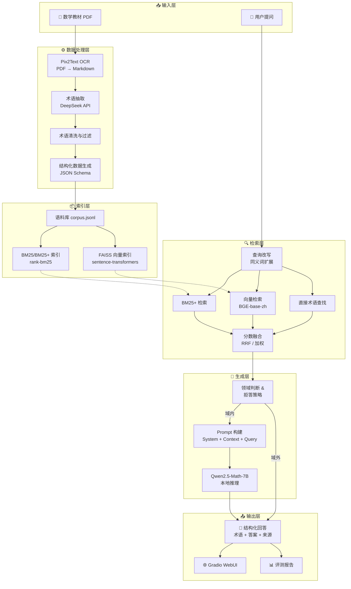

---

## 图 2：数据处理流水线

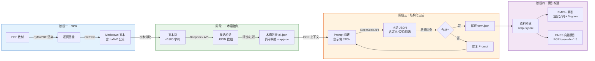

---

## 图 3：混合检索策略架构

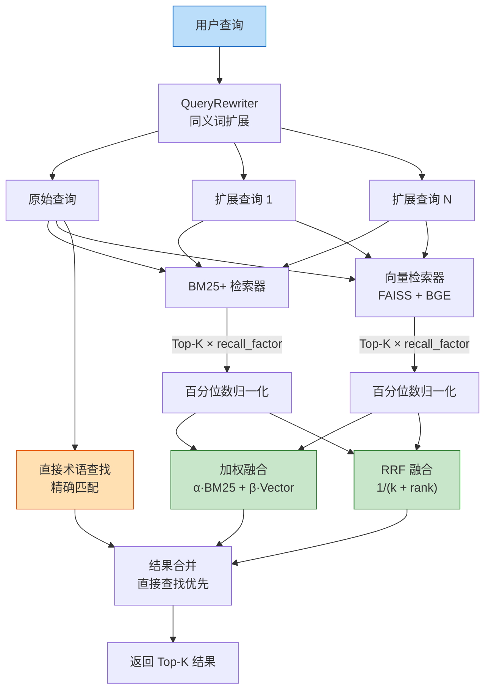

---

## 图 4：RAG 问答流程（核心 Pipeline）

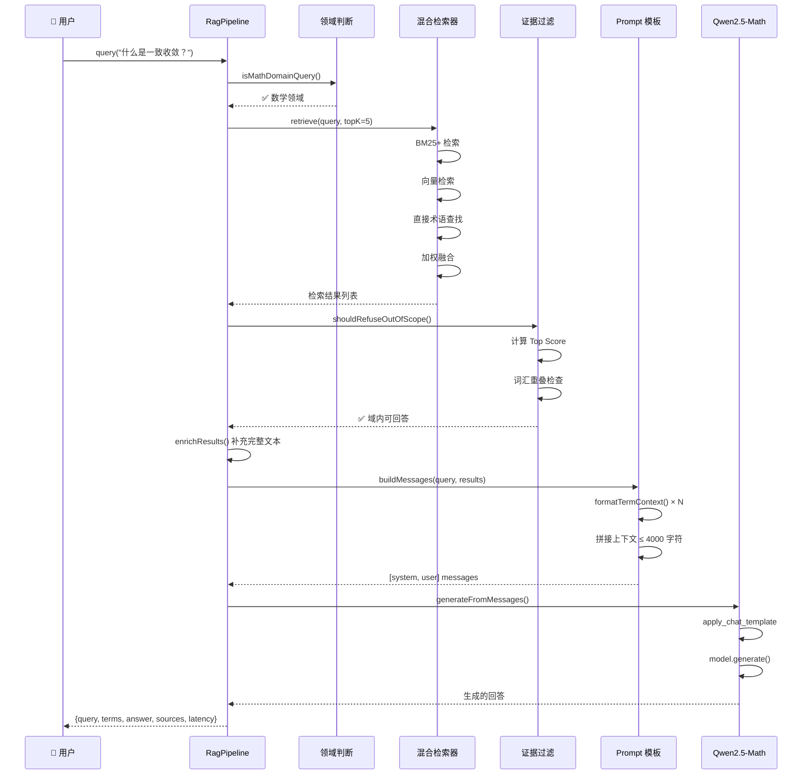

---

## 图 5：项目模块依赖关系图

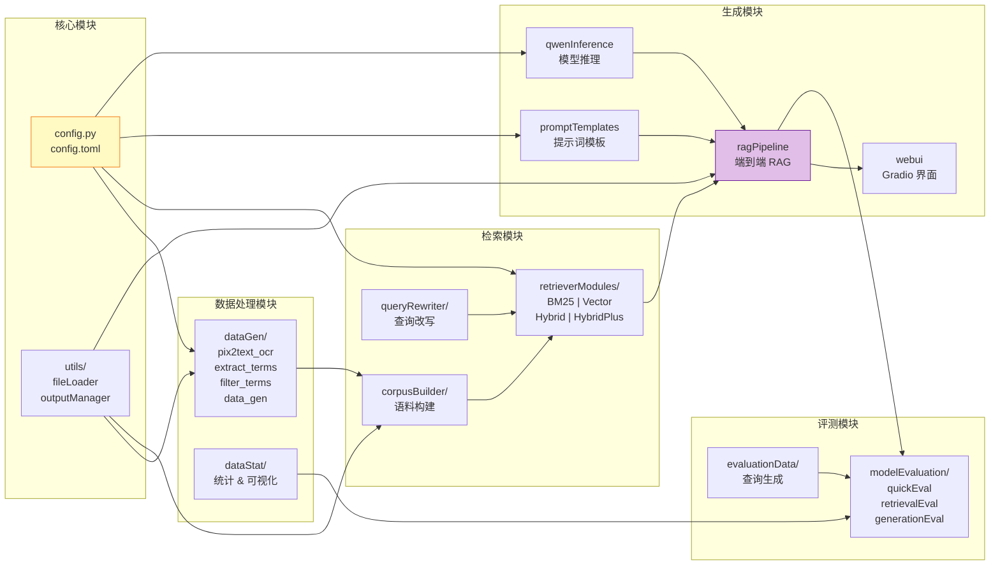

---

## 图 6：检索器类继承与组合关系

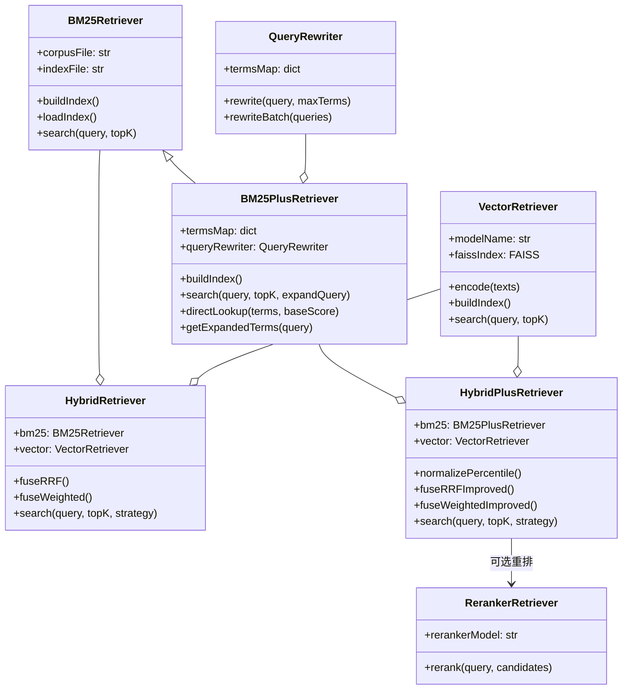

---

## 图 7：分数融合机制详解

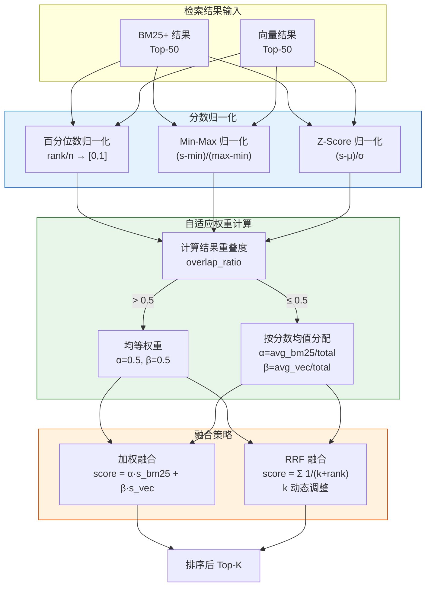

---

## 图 8：域外拒答决策流程

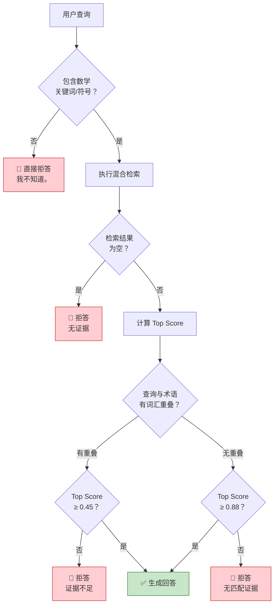

---

## 图 9：Prompt 模板构建流程

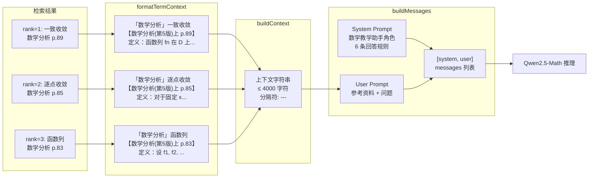

---

## 图 10：术语数据 JSON Schema

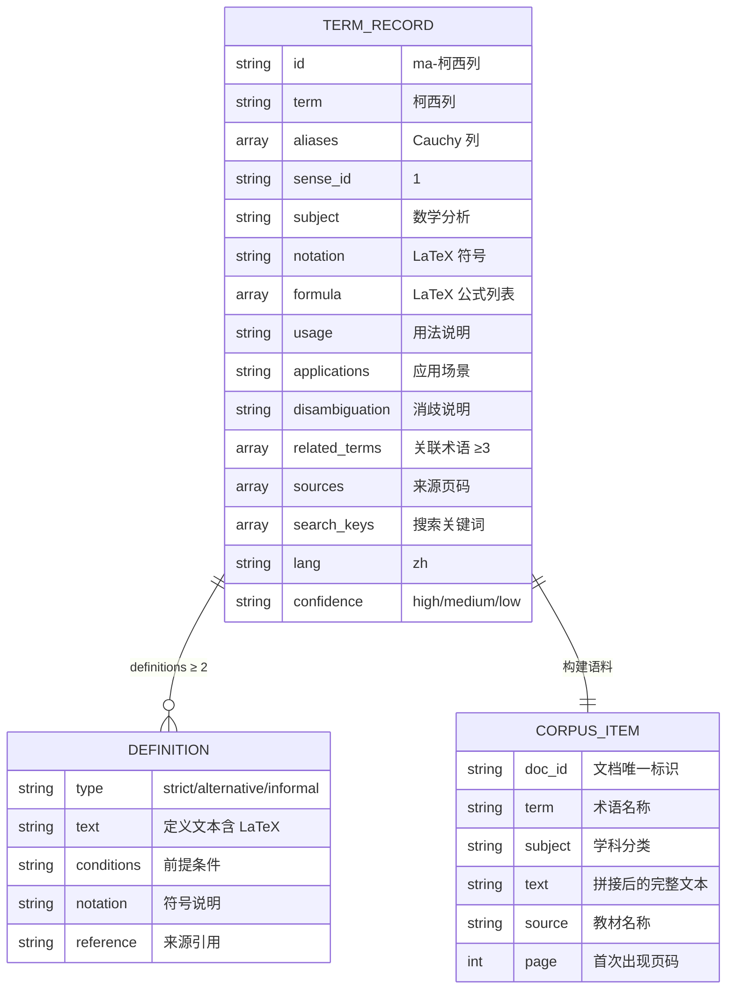

---

## 图 11：评测体系架构

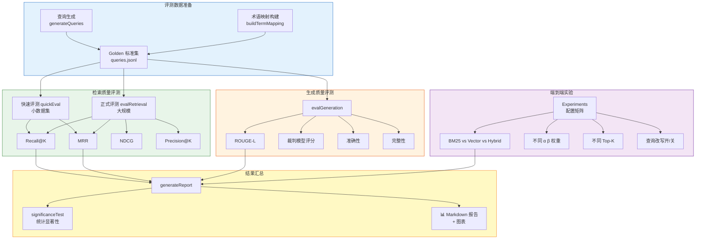

---

## 图 12：技术栈与工具链全景图

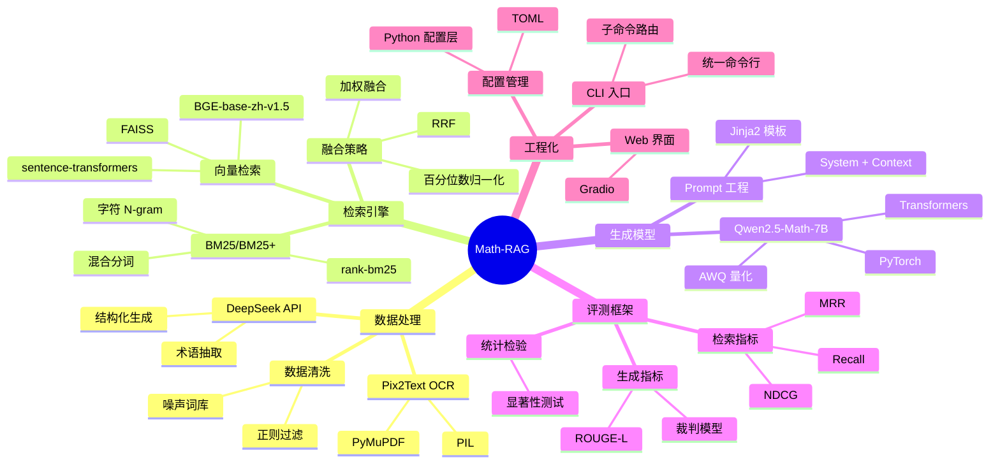

---

## 图 13：语料构建与索引流程

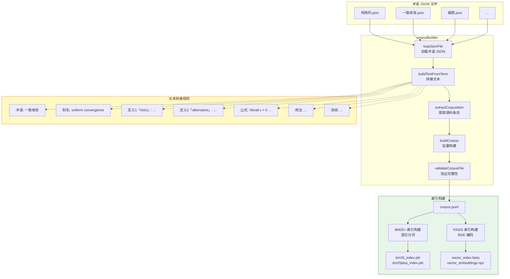

---

## 图 14：CLI 命令路由架构

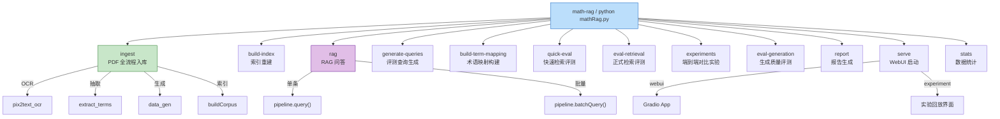

---

## 图 15：BM25+ 改进检索器详解

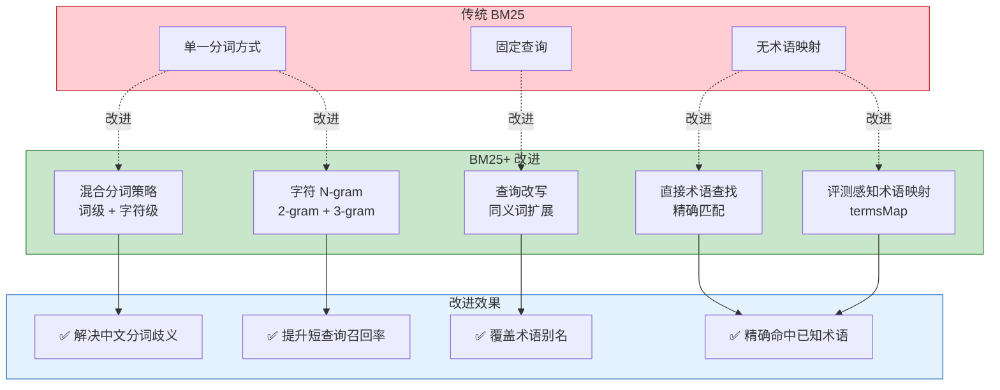

---

## 图 16：数据目录结构总览

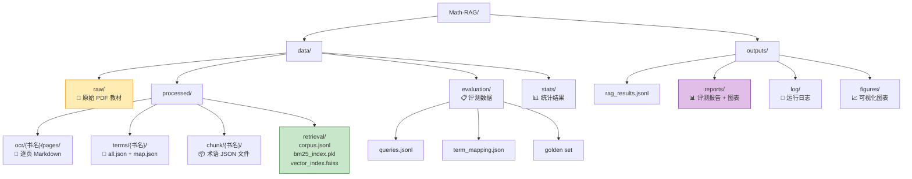

---

## 图 17：Qwen 模型推理流程

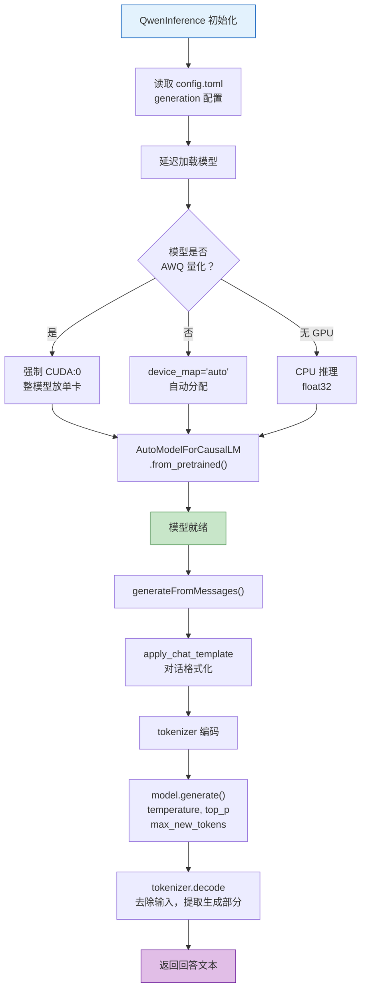

---

## 图 18：实验对比维度矩阵

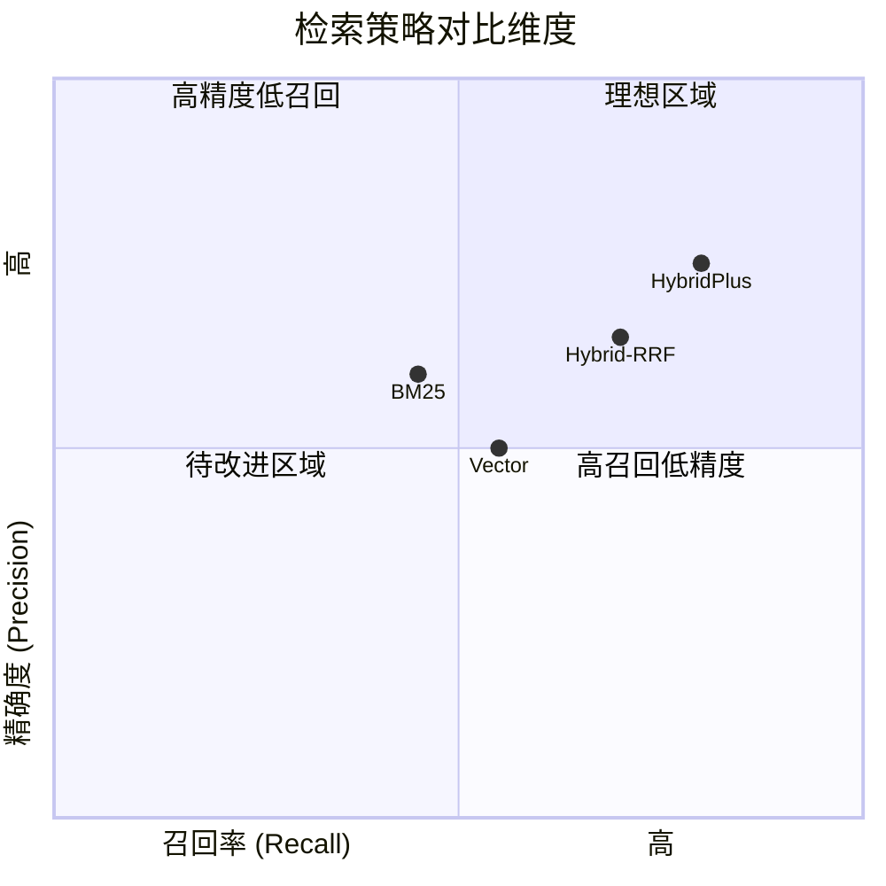

> ⚠️ 上图数据为示意，请替换为你的实验真实数据。

---

## 图 19：查询改写同义词扩展示意

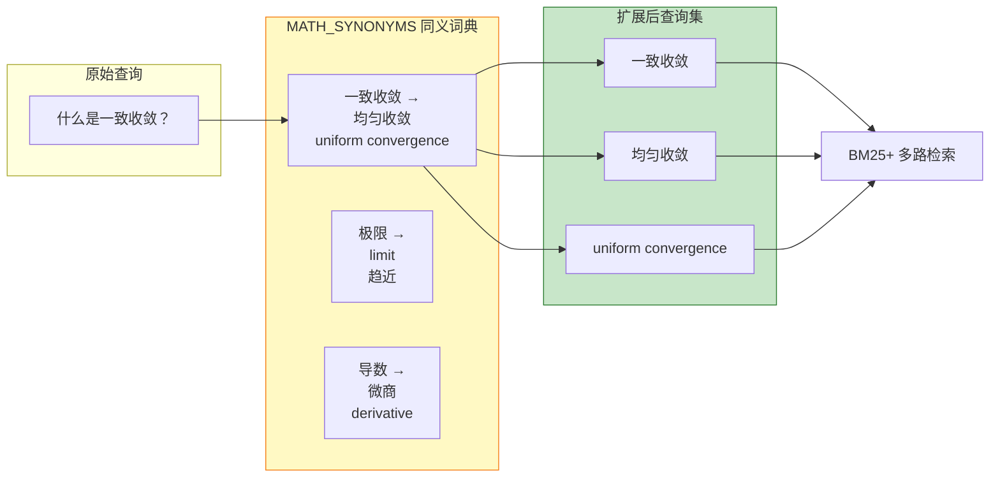

---

## 图 20：系统部署架构

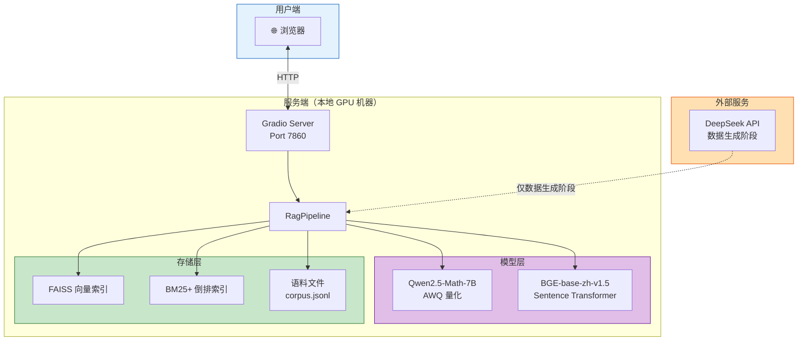
